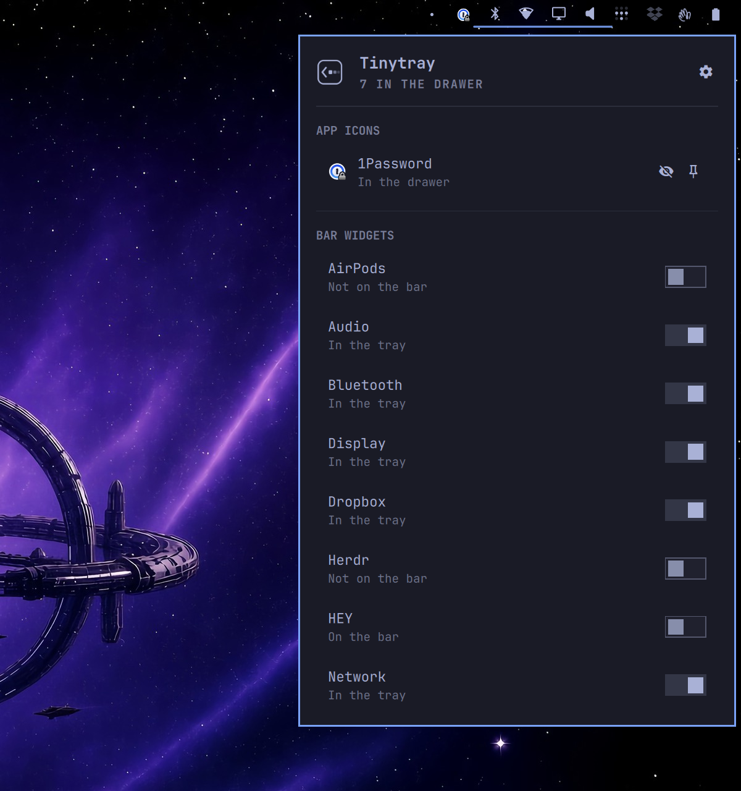
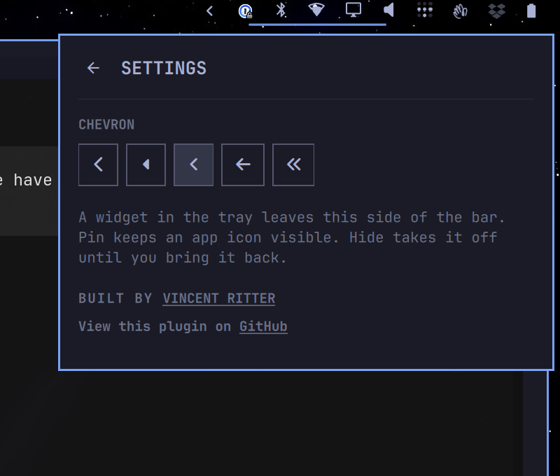

# Tinytray


Tinytray is a hover drawer for the Omarchy bar. App icons such as 1Password sit in the drawer, and other bar widgets can sit next to them instead of taking a permanent slot on the right.

Stock Omarchy only draws tray apps. Bluetooth, Network, and Display are bar widgets, so they stay on the bar unless something hosts them. Tinytray replaces `omarchy.tray` and hosts those three in the drawer on first run. Pin an app icon to keep it visible. Hide one to take it off the bar.





## Install

```bash
omarchy plugin add https://github.com/vincentritter/omarchy-tinytray.git --enable
```

Enabling Tinytray swaps the built-in tray for it. Audio and Power stay on the bar. Dropbox, Tailscale, and other widgets on this side can move into the drawer from the manage menu.

## Use

Hover the chevron to open the drawer.


Click the chevron to host or return bar widgets, and to pin or hide app icons. Hidden icons come back from that same menu. The gear opens settings, including which chevron to show.

The menu lists widgets on this side of the bar, and installed widgets that are not on the bar. It does not take anything off the other side. A switch on hosts the widget in the tray and removes it from this side. A switch off puts it back. Widgets that are installed but missing from the layout are marked not on the bar.

LocalSend is filtered out on purpose. Dropbox’s native tray icon is hidden while the Omarchy Dropbox widget is hosted, so you do not get two Dropbox marks.

The hosted list is `extraWidgets` on the `vincentritter.tinytray` layout entry in `~/.config/omarchy/shell.json`. If the key is missing, Bluetooth, Network, and Display are hosted. An empty list means none. `chevron` is `chevron`, `caret`, `angle`, `arrow`, `double`, or `dot`.

## Update

```bash
omarchy plugin update vincentritter.tinytray --yes
```

## Remove

Omarchy will not run plugin uninstall hooks. Use Tinytray’s own script, which removes the plugin (the built-in tray comes back) and then puts hosted widgets back on the bar:

```bash
~/.config/omarchy/plugins/vincentritter.tinytray/uninstall
```

Hosted widgets return before Audio when it is there, otherwise on the right. `omarchy plugin remove vincentritter.tinytray --yes` only swaps the tray back and leaves hosted widgets off the bar.

## Tests

```bash
node --test TrayModel.test.js
```
